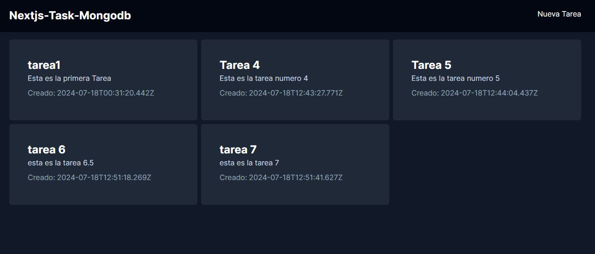

# Aplicación de Gestión de Tareas



## Tabla de Contenidos

- [Acerca del Proyecto](#acerca-del-proyecto)
- [Características](#características)
- [Construido con](#construido-con)
- [Comenzando](#comenzando)
  - [Requisitos Previos](#requisitos-previos)
  - [Instalación](#instalación)
- [Uso](#uso)
- [Hoja de Ruta](#hoja-de-ruta)


## Acerca del Proyecto

Esta es una aplicación de gestión de tareas construida con Next.js, React y MongoDB. Permite a los usuarios crear, actualizar y eliminar tareas. Este proyecto muestra mis habilidades en el desarrollo full-stack utilizando tecnologías modernas.

## Características

- Autenticación y autorización de usuarios
- Crear, actualizar y eliminar tareas
- Diseño responsivo para móvil y escritorio
- Actualizaciones en tiempo real con WebSockets

## Construido con

- [Next.js](https://nextjs.org/)
- [React](https://reactjs.org/)
- [MongoDB](https://www.mongodb.com/)
- [Tailwind CSS](https://tailwindcss.com/)
- [Node.js](https://nodejs.org/)

## Comenzando

Para obtener una copia local en funcionamiento, sigue estos sencillos pasos.

### Requisitos Previos

Asegúrate de tener lo siguiente instalado en tu máquina local:

- Node.js
- npm
- MongoDB

### Instalación

1. Clona el repositorio
```sh
   git clone https://github.com/gabykap29/crud-nextjs-react.git
```
2. Instalar las dependencias necesarias
```sh
    npm install
```
3. Ejecutar el servidor
```sh
    npm run dev
```

### Uso
Una vez que el servidor de desarrollo esté en funcionamiento, puedes abrir http://localhost:3000 para ver la aplicación.

- Crea una nueva tarea haciendo clic en el botón "nueva tarea"
- Actualiza una tarea haciendo clic en la tarea y editando los detalles
- Elimina una tarea haciendo clic en el boton de eliminar junto a la tarea
